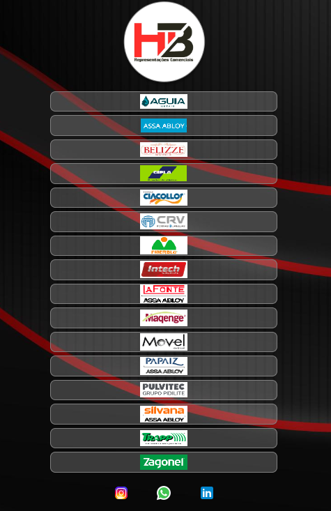

<h1 align="center"> HB Representações </h1>

Programa para apresentação das EMPRESAS através do site  

  

  

## 🚀 Tecnologiasgit 

Esse projeto foi desenvolvido com as seguintes tecnologias:

- HTML 
- CSS
- Git
- Github

## 💻 Link Projeto

https://arianegaucha.github.io/Projeto-HB/

